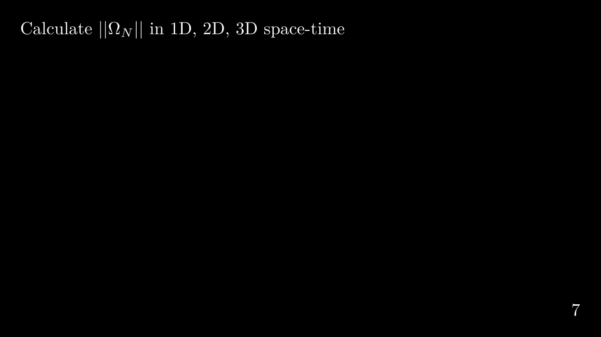

# Materials Science Animations
A home for interesting and intuitive animations related to materials science.

## Example Gallery
### Calculate the time cone volume in 1D, 2D, 3D space-time
An animation that visually explains the calculation steps 
for the time cone volume in 1D, 2D, 3D space-time.

[[Source code here]](https://github.com/rpw199912j/matsci_animation/blob/master/present.py#L780)

### Phase fraction to Time-Temperature-Transformation diagram
An animation that shows how we can get a Time-Temperature-Transformation phase diagram 
by plotting the (volume) phase fraction transformed as a function of time at different temperatures.

[[Source code here]](https://github.com/rpw199912j/matsci_animation/blob/master/present.py#L1173)

### Convert probability at a single point to overall phase fraction

[[Source code here]](https://github.com/rpw199912j/matsci_animation/blob/master/present.py#L471)
This animation shows, at an arbitrary time, how we can get the overall phase fraction transformed/untransformed by sampling the
probability of being transformed/untransformed at multiple points in space. 
Here I assume the material undergoing the phase transformation is nucleating and growing on a 2D plane. 
Since I set the probability of being untransformed at an arbitrary point in space 
(or the probability that no nucleation has occurred) to be 0.2, the overall phase fraction transformed should be 0.8.
What I first showed is that we are sampling evenly a 10 by 10 grid on a 2D plane, giving us 100 squares. 
Within each square on that grid, there is a 0.2 probability that it will not be transformed 
(i.e., 0.8 probability that it will be transformed). 
If a phase transformation does occur within that square, 
we populate that square with a white circle; if there isn't a phase transformation, 
that square will be left blank. 
To simulate the phase transformation process, 
I use a random number generator to give me a 10 by 10 grid of numbers in the range of [0, 1). 
For each number, if it is greater than or equal to 0.2, then a phase transformation has occurred; 
if the number is less than 0.2, then a phase transformation has not occurred. 
After all of this, the number of white circles should be close to 80. 
However, since we only have a 10 by 10 grid, and also due to the probabilistic nature of the simulation, 
the number of white circles won't always be exactly 80. 
We could, in theory, increase the size of the sampling grid and let it approach a number on the order of 10^23, which would mimic a real-life material and also give us a fraction very close to 0.8. The last part of the animation is just fun to visualize. What I am trying to show is that instead of counting the number of white circles and divide it by 100 to get the overall phase fraction transformed, we can treat all the circles as rigid bodies and simulate the effect of gravity so that all the circles should fill up to about the 80% horizontal line. 